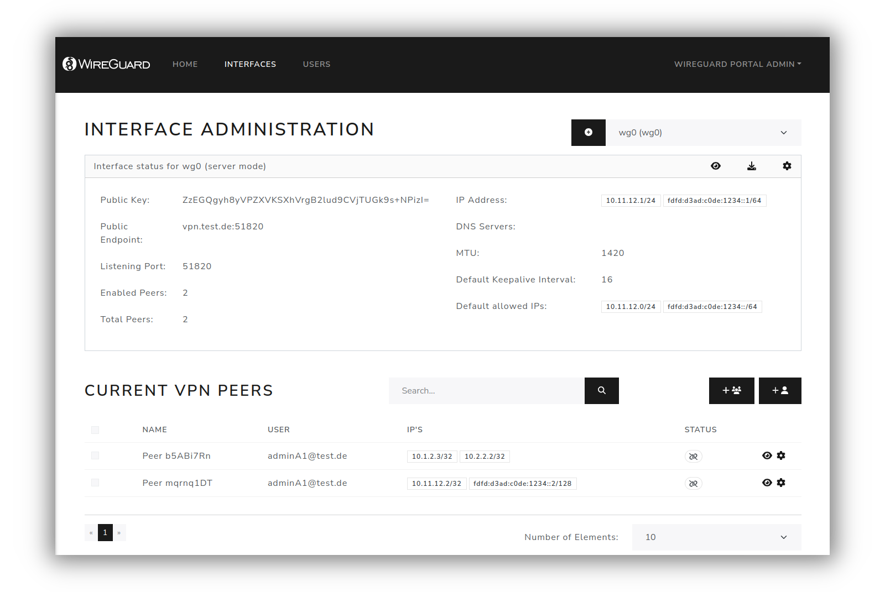

# WireGuard Portal (v2 - testing)

> [!CAUTION]
> Version 2 is currently under development and may contain bugs and breaking changes.
> It is not advised to use this version in production. Use version [v1](https://github.com/h44z/wg-portal/tree/stable) instead.

> [!IMPORTANT]
> Since the project was accepted by the Docker-Sponsored Open Source Program, the Docker image location has moved to [wgportal/wg-portal](https://hub.docker.com/r/wgportal/wg-portal).
> Please update the Docker image from **h44z/wg-portal** to **wgportal/wg-portal**.

## Introduction
<!-- Text from this line # is included in docs/documentation/overview.md -->
**WireGuard Portal** is a simple, web-based configuration portal for [WireGuard](https://wireguard.com) server management.
The portal uses the WireGuard [wgctrl](https://github.com/WireGuard/wgctrl-go) library to manage existing VPN
interfaces. This allows for the seamless activation or deactivation of new users without disturbing existing VPN
connections.

The configuration portal supports using a database (SQLite, MySQL, MsSQL or Postgres), OAuth or LDAP
(Active Directory or OpenLDAP) as a user source for authentication and profile data.

## Features

* Self-hosted - the whole application is a single binary
* Responsive multi-language web UI written in Vue.JS
* Automatically selects IP from the network pool assigned to the client
* QR-Code for convenient mobile client configuration
* Sends email to the client with QR-code and client config
* Enable / Disable clients seamlessly
* Generation of wg-quick configuration file (`wgX.conf`) if required
* User authentication (database, OAuth, or LDAP)
* IPv6 ready
* Docker ready
* Can be used with existing WireGuard setups
* Support for multiple WireGuard interfaces
* Peer Expiry Feature
* Handles route and DNS settings like wg-quick does
* Exposes Prometheus metrics for monitoring and alertingt
* REST API for management and client deployment

<!-- Text to this line # is included in docs/documentation/overview.md -->

## Documentation

For the complete documentation visit [wgportal.org](https://wgportal.org).

## V2 TODOs

* Audit UI

## What is out of scope

* Automatic generation or application of any `iptables` or `nftables` rules.
* Support for operating systems other than linux.
* Automatic import of private keys of an existing WireGuard setup.

## Application stack

* [wgctrl-go](https://github.com/WireGuard/wgctrl-go) and [netlink](https://github.com/vishvananda/netlink) for interface handling
* [Gin](https://github.com/gin-gonic/gin), HTTP web framework written in Go
* [Bootstrap](https://getbootstrap.com/), for the HTML templates
* [Vue.JS](https://vuejs.org/), for the frontend

## License

* MIT License. [MIT](LICENSE.txt) or <https://opensource.org/licenses/MIT>
