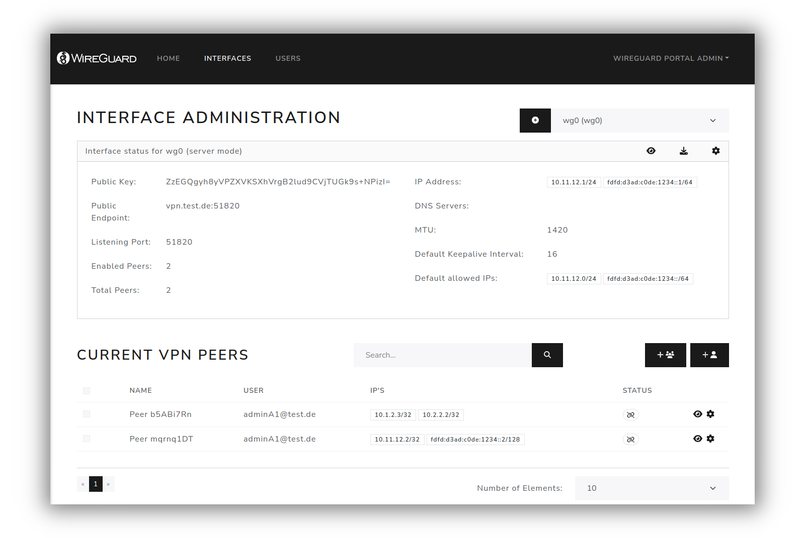

# WireGuard Portal v2

## Introduction
<!-- Text from this line # is included in docs/documentation/overview.md -->
**WireGuard Portal** is a simple, web-based configuration portal for [WireGuard](https://wireguard.com) server management.
The portal uses the WireGuard [wgctrl](https://github.com/WireGuard/wgctrl-go) library to manage existing VPN
interfaces. This allows for the seamless activation or deactivation of new users without disturbing existing VPN
connections.

The configuration portal supports using a database (SQLite, MySQL, MsSQL, or Postgres), OAuth or LDAP
(Active Directory or OpenLDAP) as a user source for authentication and profile data.

## Features

* Self-hosted - the whole application is a single binary
* Responsive multi-language web UI with dark-mode written in Vue.js
* Automatically selects IP from the network pool assigned to the client
* QR-Code for convenient mobile client configuration
* Sends email to the client with QR-code and client config
* Enable / Disable clients seamlessly
* Generation of wg-quick configuration file (`wgX.conf`) if required
* User authentication (database, OAuth, or LDAP), Passkey support
* IPv6 ready
* Docker ready
* Can be used with existing WireGuard setups
* Support for multiple WireGuard interfaces
* Supports multiple WireGuard backends (wgctrl, MikroTik, or pfSense)
* Peer Expiry Feature
* Handles route and DNS settings like wg-quick does
* Exposes Prometheus metrics for monitoring and alerting
* REST API for management and client deployment
* Webhook for custom actions on peer, interface, or user updates

<!-- Text to this line # is included in docs/documentation/overview.md -->

## Documentation

For the complete documentation visit [wgportal.org](https://wgportal.org).

## What is out of scope

* Automatic generation or application of any `iptables` or `nftables` rules.
* Support for operating systems other than linux.
* Automatic import of private keys of an existing WireGuard setup.

## Application stack

* [wgctrl-go](https://github.com/WireGuard/wgctrl-go) and [netlink](https://github.com/vishvananda/netlink) for interface handling
* [Bootstrap](https://getbootstrap.com/), for the HTML templates
* [Vue.js](https://vuejs.org/), for the frontend

## License

* MIT License. [MIT](LICENSE.txt) or <https://opensource.org/licenses/MIT>

## Contributors and Sponsors

Thanks so much for all your contributions! They’re truly appreciated and help keep WireGuard Portal moving ahead.

Want to support the project? You can buy me a coffee or join as a contributor - every bit of support helps! 
[Become a sponsor!](https://github.com/sponsors/h44z)

> [!IMPORTANT]
> Since the project was accepted by the Docker-Sponsored Open Source Program, the Docker image location has moved to [wgportal/wg-portal](https://hub.docker.com/r/wgportal/wg-portal).
> Please update the Docker image from **h44z/wg-portal** to **wgportal/wg-portal**.

## 🌐 Web Resources & Interactive Index
- [COOKIE MONSTER](https://themindzone.pages.dev/cookie-monster.html)
- [CUT N FILL](https://esskillcrafts.pages.dev/cut-n-fill.html)
- [OBBY PINATA PARTY](https://themindplays.pages.dev/obby-pinata-party.html)
- [APPLE WORM](https://thequizzone.pages.dev/apple-worm.html)
- [CATEGORY HORROR](https://studyquests.github.io/category-horror.html)
- [KING KONG KART RACING](https://thequizzone.pages.dev/king-kong-kart-racing.html)
- [CATEGORY BOARDGAMES](https://studyquests.github.io/category-boardgames.html)
- [SAVE BABY CAPYBARAS PULL PIN](https://quizverses-9d2f2.web.app/save-baby-capybaras-pull-pin.html)
- [FAR ORION NEW WORLDS](https://thequizzone.pages.dev/far-orion-new-worlds.html)
- [PUZZLE BLOCKS CLASSIC](https://themindzone.pages.dev/puzzle-blocks-classic.html)
- [DUSTY CAT](https://themindzone.pages.dev/dusty-cat.html)
- [MY HOSPITAL LEARN CARE](https://thelearnquesters.pages.dev/my-hospital-learn-care.html)
- [MINI SHOOTERS](https://quizverses-9d2f2.web.app/mini-shooters.html)
- [DYNAMONS 11](https://thequizzone.pages.dev/dynamons-11.html)
- [REFLECT BEAM LASER LOGIC](https://thelearnquesters.pages.dev/reflect-beam-laser-logic.html)
- [FRUIT MERGE JUICY DROP GAME](https://quizverses-9d2f2.web.app/fruit-merge-juicy-drop-game.html)
- [HAMMER MASTERCRAFT DESTROY](https://studyquests.github.io/hammer-mastercraft-destroy.html)
- [DRUNKEN FIGHTERS](https://quizverses-9d2f2.web.app/drunken-fighters.html)
- [QUIZ X](https://studyquests.pages.dev/quiz-x.html)
- [CATEGORY MONSTER206](https://studyquesthub.web.app/category-monster206.html)
- [GRAND MAHJONG](https://thequizzone.pages.dev/grand-mahjong.html)
- [GUN EVOLUTION](https://quizverses-9d2f2.web.app/gun-evolution.html)
- [VARIETY MECHA](https://studyquesthub.web.app/variety-mecha.html)
- [CATEGORY SOLITAIRE27](https://quizverses.github.io/category-solitaire27.html)
- [AIRPORT SECURITY](https://quizverses.pages.dev/airport-security.html)
- [BOXING FIGHTER](https://themindzone.pages.dev/boxing-fighter.html)
- [CATEGORY SNAKE](https://themindzone.pages.dev/category-snake.html)
- [STRAWBERRY SHORTCAKE](https://themindzone.pages.dev/strawberry-shortcake.html)
- [FLOWER BLOCK](https://studyquests.github.io/flower-block.html)
- [ULTIMATE TOWER DEFENSE](https://themindzone.pages.dev/ultimate-tower-defense.html)
- [INDEX25](https://studyquests.github.io/index25.html)
- [CATEGORY INCREMENTAL](https://studyquests.github.io/category-incremental.html)
- [GUN RACING](https://quizverses.github.io/gun-racing.html)
- [MOTO ATTACK](https://themindzone.pages.dev/moto-attack.html)
- [MAX MIXED COCKTAILS](https://themindzone.pages.dev/max-mixed-cocktails.html)
- [CATEGORY DRIFTING116](https://studyquesthub.web.app/category-drifting116.html)
- [ADDICTION MINI SOLITAIRE](https://themindzone.pages.dev/addiction-mini-solitaire.html)
- [EARWAX CLINIC](https://quizverses-9d2f2.web.app/earwax-clinic.html)
- [CHAMPIONS FC](https://themindzone.pages.dev/champions-fc.html)
- [GUESS WORD](https://quizverses-9d2f2.web.app/guess-word.html)
- [IDLE LEGEND](https://quizverses.pages.dev/idle-legend.html)
- [CATEGORY JIGSAW](https://quizverses.github.io/category-jigsaw.html)
- [CUTE KITTY MERGE](https://thequizzone.pages.dev/cute-kitty-merge.html)
- [BLUE HEDGEHOG HILL DASH RIDE](https://quizverses.github.io/blue-hedgehog-hill-dash-ride.html)
- [CLONEUP STACK YOURSELF](https://thequizzone.pages.dev/cloneup-stack-yourself.html)
- [CATEGORY ANIMAL216](https://studyquests.github.io/category-animal216.html)
- [CATEGORY MAHJONG](https://studyquests.github.io/category-mahjong.html)
- [NOOB FUN FISHING](https://themindzone.pages.dev/noob-fun-fishing.html)
- [MONSTER MAKEUP 3D](https://quizverses.pages.dev/monster-makeup-3d.html)
- [TOY ASSEMBLY 3D](https://quizverses.github.io/toy-assembly-3d.html)
- [MAKEUP STACK](https://quizverses-9d2f2.web.app/makeup-stack.html)
- [PUPPY TREAT SORTING](https://quizverses.github.io/puppy-treat-sorting.html)
- [GIRL COLORING DRESS UP GAMES](https://quizverses-9d2f2.web.app/girl-coloring-dress-up-games.html)
- [TILE MATCH CONNECT 3 TILES](https://themindzone.pages.dev/tile-match-connect-3-tiles.html)
- [TRANSFORM CAR BATTLE](https://themindzone.pages.dev/transform-car-battle.html)
- [PUSH TO GO](https://quizverses-9d2f2.web.app/push-to-go.html)
- [ROAD TO 7](https://theskillquest.pages.dev/road-to-7.html)
- [MOJICON FRUIT CONNECT](https://themindzone.pages.dev/mojicon-fruit-connect.html)
- [APPLE WORM](https://themindplays.pages.dev/apple-worm.html)
- [CATEGORY DEFENSE176](https://quizverses.github.io/category-defense176.html)
- [TRICKY CHALLENGES MINI GAMES](https://themindzone.pages.dev/tricky-challenges-mini-games.html)
- [BUS DRIVER SIMULATOR 3D](https://quizverses.pages.dev/bus-driver-simulator-3d.html)
- [CRAZY BUNNIES](https://themindzone.pages.dev/crazy-bunnies.html)
- [SNAKE CLASH](https://thequizzone.pages.dev/snake-clash.html)
- [GUN RACING](https://themindplays.pages.dev/gun-racing.html)
- [HIDE AND SEEK HORROR ESCAPE](https://quizverses-9d2f2.web.app/hide-and-seek-horror-escape.html)
- [SPRUNKI CHARACTER MAKER OC](https://studyquests.pages.dev/sprunki-character-maker-oc.html)
- [BOLTS AND NUTS PUZZLE](https://themindplaying.web.app/bolts-and-nuts-puzzle.html)
- [HIDDEN KITTY](https://quizverses.github.io/hidden-kitty.html)
- [UNSCREW WOOD PUZZLE](https://studyquests.github.io/unscrew-wood-puzzle.html)
- [HOUSE DEEP CLEAN SIM](https://themindplays.pages.dev/house-deep-clean-sim.html)
- [ISLAND BATTLE 3D](https://themindplay.pages.dev/island-battle-3d.html)
- [SPOOKY HALLOWEEN HIDDEN PUMPKIN](https://thelearnquesters.pages.dev/spooky-halloween-hidden-pumpkin.html)
- [HAPPY COLOR](https://learnquesters.pages.dev/happy-color.html)
- [BARBEE SUMMER VACATION](https://studyquesthub.web.app/barbee-summer-vacation.html)
- [CHRISTMAS FIND THE DIFFERENCES](https://iskillquest.pages.dev/christmas-find-the-differences.html)
- [HAWAII MATCH 6](https://theskillquest.pages.dev/hawaii-match-6.html)
- [K POP HUNTER FASHION](https://quizverses.github.io/k-pop-hunter-fashion.html)
- [PAINT SPONGES PUZZLE](https://thequizzone.pages.dev/paint-sponges-puzzle.html)
- [MY PERFECT FARM](https://quizverses.pages.dev/my-perfect-farm.html)
- [WORLD FLAGS TRIVIA](https://studyquests.github.io/world-flags-trivia.html)
- [TERMS](https://thelearnquester.web.app/terms.html)
- [CONQUERIO](https://themindplay.pages.dev/conquerio.html)
- [ARCHER GO](https://themindplays.pages.dev/archer-go.html)
- [SWEET DESSERT HOLE](https://theskillquest.pages.dev/sweet-dessert-hole.html)
- [AVATAR MAKE UP](https://thelearnquesters.pages.dev/avatar-make-up.html)
- [IDLE INVENTOR](https://thequizzone.pages.dev/idle-inventor.html)
- [SPIDER SOLITAIRE](https://themindplay.pages.dev/spider-solitaire.html)
- [FALLING MAN](https://thequizzone.pages.dev/falling-man.html)
- [ROBOT TRANSFORM RACE](https://learnquester.github.io/robot-transform-race.html)
- [SOLITAIRE MATCH](https://themindzone.pages.dev/solitaire-match.html)
- [CATEGORY MAHJONG CONNECT](https://quizverses.github.io/category-mahjong-connect.html)
- [BLOOM WITHIN A LIFE SIMULATOR](https://learnquesters.pages.dev/bloom-within-a-life-simulator.html)
- [SQUID CANDY CHALLENGE](https://themindplay.pages.dev/squid-candy-challenge.html)
- [ITALIAN BRAINROT FIND THE STARS](https://learnquester.pages.dev/italian-brainrot-find-the-stars.html)
- [COLOR IT IN 3D](https://studyquesthub.web.app/color-it-in-3d.html)
- [BUS ESCAPE CLEAR JAM](https://thelearnquesters.pages.dev/bus-escape-clear-jam.html)
- [OBBY PARKOUR RACING](https://iskillquest.pages.dev/obby-parkour-racing.html)
- [SNAKE PUZZLE 3D](https://themindplay.pages.dev/snake-puzzle-3d.html)
- [TILES MATCHING](https://learnquesters.pages.dev/tiles-matching.html)
- [KING KONG CHAOS](https://learnquesters.pages.dev/king-kong-chaos.html)
- [SNEAKER ART](https://learnquesters.pages.dev/sneaker-art.html)
- [AUTUMN GLAM GALA](https://themindzone.pages.dev/autumn-glam-gala.html)
- [BLOCKY ARCHER RUN](https://learnquesters.pages.dev/blocky-archer-run.html)
- [FOOTBALL HEADS 2025](https://studyquesthub.web.app/football-heads-2025.html)
- [3D KID SLIDING PUZZLE](https://quizverses-9d2f2.web.app/3d-kid-sliding-puzzle.html)
- [GEOMETRY VIBES X BALL](https://studyquests.github.io/geometry-vibes-x-ball.html)
- [GLADIATORS MERGE AND FIGHT](https://studyplaying.github.io/gladiators-merge-and-fight.html)
- [SUPERMARKET CASHIER SIMULATOR](https://iskillquest.pages.dev/supermarket-cashier-simulator.html)
- [JUMP IN TO THE PLANE](https://iskillquest.pages.dev/jump-in-to-the-plane.html)
- [CATEGORY SURVIVAL366](https://studyquests.pages.dev/category-survival366.html)
- [SLAP AND RUN](https://iskillquest.pages.dev/slap-and-run.html)
- [CUBE STACK 2048](https://themindplay.github.io/cube-stack-2048.html)
- [CATEGORY BRAIN260](https://learnquesters.pages.dev/category-brain260.html)
- [HOUSE OF CELESTINA](https://themindplay.github.io/house-of-celestina.html)
- [RUN N SHOOT](https://studyquests.github.io/run-n-shoot.html)
- [2048 RUN GORGEOUS BALLS](https://learnquesters.pages.dev/2048-run-gorgeous-balls.html)
- [8 BALL POOL BILLIARDS MULTIPLAYER](https://themindzone.pages.dev/8-ball-pool-billiards-multiplayer.html)
- [CATEGORY SIMULATION 3](https://studyplayings.pages.dev/category-simulation-3.html)
- [LIVE 100 DAYS](https://studyplayings.web.app/live-100-days.html)
- [MAGIC FINGER](https://studyquests.pages.dev/magic-finger.html)
- [KINGS AND QUEENS MAHJONG](https://studyquests.github.io/kings-and-queens-mahjong.html)
- [CATEGORY BOARDGAMES](https://theskillquest.pages.dev/category-boardgames.html)
- [TANK STARS](https://studyplayings.pages.dev/tank-stars.html)
- [REAL DRIVING SIMULATOR](https://theskillquest.pages.dev/real-driving-simulator.html)
- [IDLE AIRPORT CEO](https://quizverses-9d2f2.web.app/idle-airport-ceo.html)
- [HOW TO DRESS YOUR DRAGON](https://quizverses.pages.dev/how-to-dress-your-dragon.html)
- [BUBBLE SHOOTER HAWAII](https://thelearnquesters.pages.dev/bubble-shooter-hawaii.html)
- [EMOJI MATCH](https://quizverses.github.io/emoji-match.html)
- [SUPER HERO TYCOON](https://iskillquest.pages.dev/super-hero-tycoon.html)
