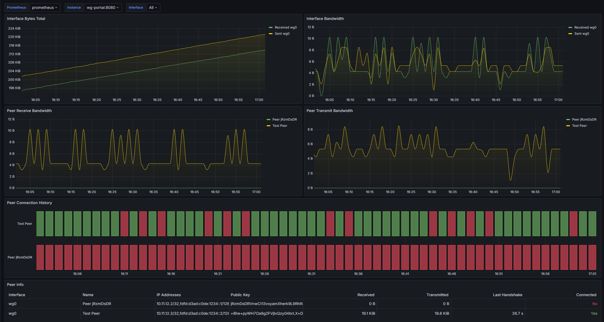

By default, WG-Portal exposes Prometheus metrics on port `8787` if interface/peer statistic data collection is enabled.

## Exposed Metrics

| Metric                                     | Type  | Description                                    |
|--------------------------------------------|-------|------------------------------------------------|
| `wireguard_interface_received_bytes_total` | gauge | Bytes received through the interface.          |
| `wireguard_interface_sent_bytes_total`     | gauge | Bytes sent through the interface.              |
| `wireguard_peer_last_handshake_seconds`    | gauge | Seconds from the last handshake with the peer. |
| `wireguard_peer_received_bytes_total`      | gauge | Bytes received from the peer.                  |
| `wireguard_peer_sent_bytes_total`          | gauge | Bytes sent to the peer.                        |
| `wireguard_peer_up`                        | gauge | Peer connection state (boolean: 1/0).          |

## Prometheus Config

Add the following scrape job to your Prometheus config file:

```yaml
# prometheus.yaml
scrape_configs:
  - job_name: wg-portal
    scrape_interval: 60s
    static_configs:
      - targets:
          - localhost:8787 # Change localhost to IP Address or hostname with WG-Portal
```

# Grafana Dashboard

You may import [`dashboard.json`](https://github.com/h44z/wg-portal/blob/master/deploy/helm/files/dashboard.json) into your Grafana instance.


