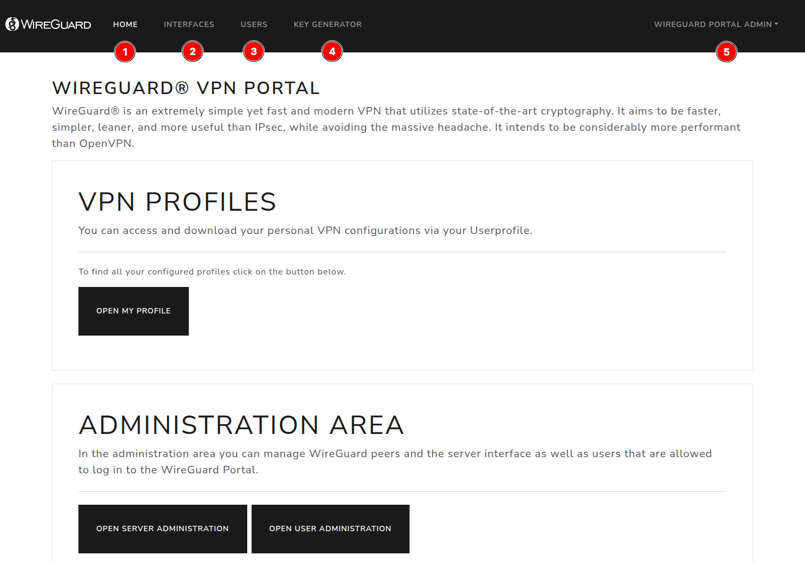
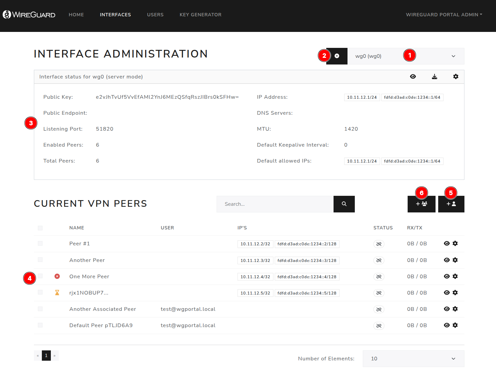

This documentation section describes the general usage of WireGuard Portal. 
If you are looking for specific setup instructions, please refer to the *Getting Started* and [*Configuration*](../configuration/overview.md) sections, 
for example, using a [Docker](../getting-started/docker.md) deployment.

## Basic Concepts

WireGuard Portal is a web-based configuration portal for WireGuard server management. It allows managing multiple WireGuard interfaces and users from a single web UI.
WireGuard Interfaces can be categorized into three types:

 - **Server**: A WireGuard server interface that to which multiple peers can connect. In this mode, it is possible to specify default settings for all peers, such as the IP address range, DNS servers, and MTU size.
 - **Client**: A WireGuard client interface that can be used to connect to a WireGuard server. Usually, such an interface has exactly one peer.
 - **Unknown**: This is the default type for imported interfaces. It is encouraged to change the type to either `Server` or `Client` after importing the interface. 

## Accessing the Web UI

The web UI should be accessed via the URL specified in the `external_url` property of the configuration file.
By default, WireGuard Portal listens on port `8888` for HTTP connections. Check the [Security](security.md) or [Authentication](authentication.md) sections for more information on securing the web UI.

So the default URL to access the web UI is:

```
http://localhost:8888
```

A freshly set-up WireGuard Portal instance will have a default admin user with the username `admin@wgportal.local` and the password `wgportal-default`. 
You can and should override the default credentials in the configuration file. Make sure to change the default password immediately after the first login!


### Basic UI Description



As seen in the screenshot above, the web UI is divided into several sections which are accessible via the navigation bar on the top of the screen.

1. **Home**: The landing page of WireGuard Portal. It provides a staring point for the user to access the different sections of the web UI. It also provides quick links to WireGuard Client downloads or official documentation.
2. **Interfaces**: This section allows you to manage the WireGuard interfaces. You can add, edit, or delete interfaces, as well as view their status and statistics. Peers for each interface can be managed here as well.
3. **Users**: This section allows you to manage the users of WireGuard Portal. You can add, edit, or delete users, as well as view their status and statistics.
4. **Key Generator**: This section allows you to generate WireGuard keys locally on your browser. The generated keys are never sent to the server. This is useful if you want to generate keys for a new peer without having to store the private keys in the database.
5. **Profile / Settings**: This section allows you to access your own profile page, settings, and audit logs. 


### Interface View



The interface view provides an overview of the WireGuard interfaces and peers configured in WireGuard Portal.

The most important elements are:

1. **Interface Selector**: This dropdown allows you to select the WireGuard interface you want to manage. 
   All further actions will be performed on the selected interface.
2. **Create new Interface**: This button allows you to create a new WireGuard interface.
3. **Interface Overview**: This section provides an overview of the selected WireGuard interface. It shows the interface type, number of peers, and other important information.
4. **List of Peers**: This section provides a list of all peers associated with the selected WireGuard interface. You can view, add, edit, or delete peers from this list.
5. **Add new Peer**: This button allows you to add a new peer to the selected WireGuard interface.
6. **Add multiple Peers**: This button allows you to add multiple peers to the selected WireGuard interface. 
   This is useful if you want to add a large number of peers at once.


---

## Peer Rotation Interval

WireGuard Portal supports an optional peer rotation interval that automatically assigns an expiry date to every newly created peer. This is useful in environments where VPN credentials should be rotated on a regular schedule.

### How It Works

When `core.peer.rotation_interval` is set to a non-zero duration, the Portal sets the `ExpiresAt` field of each new peer to `CreatedAt + rotation_interval` at creation time. If a peer already has an explicit expiry date set by an administrator, that value is preserved and not overwritten.

The existing expiry checker (controlled by `advanced.expiry_check_interval`) periodically scans all peers. When a peer's `ExpiresAt` is reached, the action defined by `core.peer.expiry_action` is applied:

- `disable` (default) — the peer is disabled and a human-readable reason is recorded (e.g. `expired on 2026-04-06T15:04:05Z`).
- `delete` — the peer record is permanently removed from storage.

### Enabling Peer Rotation

Add the following to your `config/config.yaml` under the `core` section:

```yaml
core:
  peer:
    # Peers expire 1 year after creation (use hours, not days — "d" is not a valid unit)
    rotation_interval: 8760h
    # Disable expired peers instead of deleting them (default)
    expiry_action: disable
```

Valid duration units are `s` (seconds), `m` (minutes), and `h` (hours). The `d` suffix for days is not supported by Go's duration parser — use `24h` for one day, `168h` for one week, `8760h` for one year.

Set `rotation_interval: 0` (the default) to disable automatic expiry assignment entirely.

---

## Auto-Recreate on Expiry

When peer rotation is enabled, you can optionally have WireGuard Portal automatically create a fresh replacement peer when an existing peer expires. This is useful in environments where users should always have an active VPN peer without manual intervention.

### How It Works

When `core.peer.auto_recreate_on_expiry` is set to `true`, the expiry checker first applies the configured `expiry_action` (disable or delete), then immediately creates a new peer for the same user on the same interface with fresh keys and a new expiry date based on `rotation_interval`. The peer must be linked to a user for auto-recreation to take effect.

The recreated peer's display name has a configurable suffix appended (default: `" (recreated)"`) so it can be distinguished from the original. The suffix is controlled by `core.peer.recreate_on_expiry_suffix` and is only added once — repeated recreations do not stack the suffix.

When expiry notifications are enabled, the warning emails will include a notice informing the user that a new peer will be generated and they will need to download the new configuration from the portal.

### Enabling Auto-Recreate

```yaml
core:
  peer:
    rotation_interval: 8760h
    expiry_action: delete
    auto_recreate_on_expiry: true
    recreate_on_expiry_suffix: " (recreated)"  # optional, this is the default
```

---

## Purge Disabled Expired Peers

When `expiry_action` is set to `disable`, expired peers remain in the database in a disabled state. Over time these can accumulate. The `purge_expired_after` setting automatically deletes disabled expired peers once the specified duration has passed since their expiry date.

### How It Works

During each expiry check cycle, the expiry checker scans all peers. Any peer that is both expired and disabled, and whose `ExpiresAt` is older than `purge_expired_after`, is permanently deleted.

### Enabling Purge

```yaml
core:
  peer:
    expiry_action: disable
    purge_expired_after: 720h  # delete disabled expired peers after 30 days
```

Set `purge_expired_after: 0` to disable purging entirely (disabled expired peers are kept forever).

---

## Peer Expiry Notifications

When peer rotation is enabled, WireGuard Portal can send warning emails to users before their peer expires. This gives users time to request a renewal or take other action before losing VPN access.

### How It Works

The notification manager runs on the same schedule as the expiry checker (`advanced.expiry_check_interval`). For each active peer with a non-null `ExpiresAt`, it checks whether the peer falls within any of the configured notification windows (`core.peer.expiry_notification_intervals`). If so, and if no email has already been sent for that peer/interval combination, a warning email is dispatched via the configured SMTP server.

Sent-notification records are persisted to the database so that emails are not re-sent after a Portal restart. Records older than `core.peer.notification_cleanup_after` are pruned automatically.

### Enabling Expiry Notifications

Notifications are enabled by default when `core.peer.expiry_notification_enabled` is `true`. Configure the lead times and retention period as needed:

```yaml
core:
  peer:
    expiry_notification_enabled: true
    # Send warnings 7 days, 3 days, and 1 day before expiry
    expiry_notification_intervals:
      - 168h
      - 72h
      - 24h
    # Keep sent-notification records for 30 days
    notification_cleanup_after: 720h
```

### Requirements for Notification Delivery

- The peer must be linked to a user with a valid email address.
- The peer must not already be disabled.
- The `mail` section of the configuration must point to a reachable SMTP server.

If a peer has no linked user or the user has no email address, the peer is silently skipped. Check the [Mail Templates](mail-templates.md) documentation for information on customising the expiry warning email.
